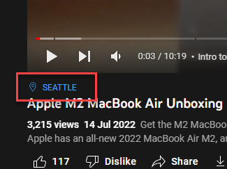

Once you had completed the steps shown on [video similarity](video_sim){:target="_blank"}, an Excel file is downloaded for further analysis.

This page serve to provide data description of what each column in the Excel file meant.

### Stats Sheet
- videoId: Unique identifier of the video
- publishedAt: Datetime when the video is available on YouTube
- recordingDate: For some videos, recording date of the videos are kept
- collectDateTime: Datetime when video information is collected
- duration: Duration of video (in seconds)
- defaultAudioLanguage: Detected Language used in video
- tags: Tags manually added by video author
- channelId: Channel Id of the video
- similarity: Similarity score when compare with seed video (1: Most Similar, 0: Least Similar)
- seedVideo: If the video is seed video (Boolean: TRUE or FALSE)
- seedchannel: If the video channel is same as seed video channel (Boolean: TRUE or FALSE)

### Loc Sheet
- locationDescription: Location set by author

### Hashtags Sheet
- hashtags: All hashtags extracted from video description 

### Topics Sheet
- topics: A list of Wikipedia URLs that provide a high-level description of the video's content

### Captions Sheet
- caption: Source caption of video
- lang: Language of caption
- translatedCaption: If source caption language is not English, automated English translated caption from YouTube are collected
- embedding: Word Embedding (vector of 512) of English caption, used to calculate similarity score

