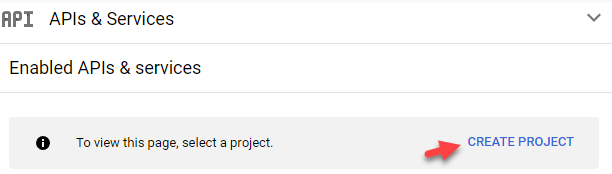
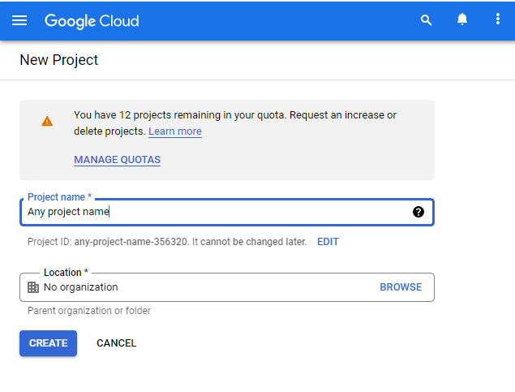
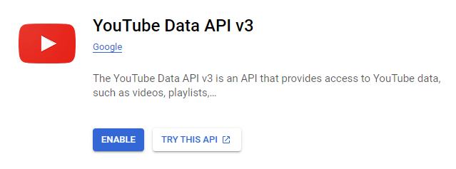
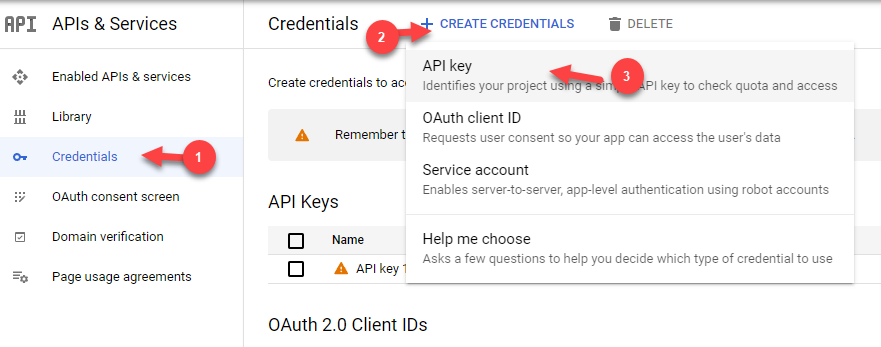
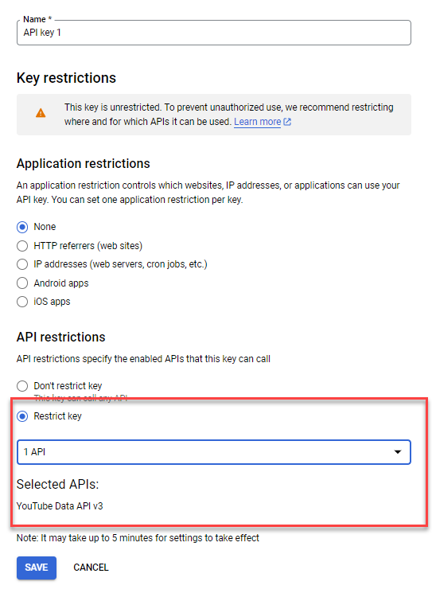
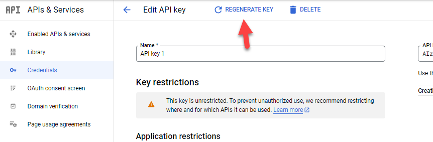

## How to access Youtube+?
Youtube+ can be access via streamlit on: 
- [Link 1](https://share.streamlit.io/ytexplorer/youtubeplus){:target="_blank"}
- [Link 2](https://share.streamlit.io/anderson2805/youtubeplus){:target="_blank"}

## How to obtain Youtube API?
Source: [Youtube API Documentation](https://developers.google.com/youtube/v3/docs/?apix=true){:target="_blank"}

1. Access [developers console](https://console.developers.google.com/){:target="_blank"}
2. Create New Project (if you do not have any)

3. Enable [Youtube Data API v3](https://console.cloud.google.com/apis/library/youtube.googleapis.com){:target="_blank"}

4. Go to Credentials> Create Credentials > API key

5. Configure the API key to improve security

6. (Optional) For each use of API key on Youtube+, we recommend regenerate key. Due to key are encrypted with HTTPS only.
