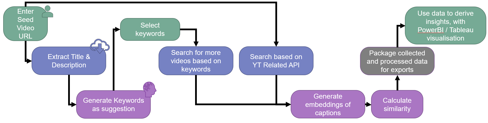
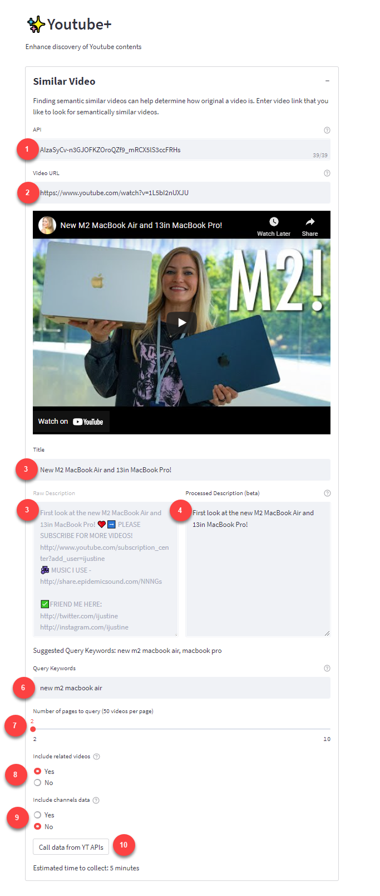
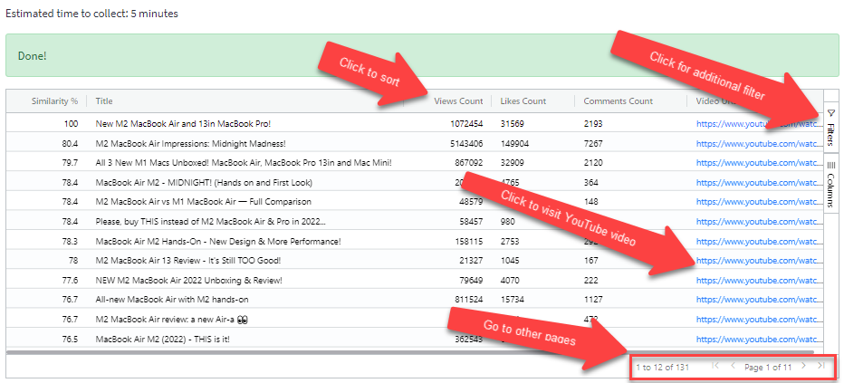

This serve a quick start guide on how to use video similarity and explanation of the features.

### Capabilities and Methodology
Video Similarity is based on having the seed video entered, additional videos collected based on keyword related to seed video and [YouTube API relatedToVideoId filter](https://developers.google.com/youtube/v3/docs/search/list){:target="_blank"}.
- Discover more videos similar to seed video
- Highlight similar videos based on words embedding of video’s caption

### Standard operating procedure:
1. Insert YouTube API obtain from credentials page. [Guide](getting-started#how-to-obtain-youtube-api){:target="_blank"}
2. Enter Video URL of interest which will be served as seed for video comparison (Do not enter additional parameters/data after "v=xxxxx" such as "&t=3228s &ab_channel=CNA")
3. Title and Description will be extracted from seed video and shown. 
4. You can make edits on "Processed Description" to manually remove call-to-actions texts or add texts wrongly removed.
5. Suggested Query Keywords will be generated based on Title and Processed Description (based on [KeyBert](https://maartengr.github.io/KeyBERT/){:target="_blank"})
6. Pick the best suggested query keyword, where more videos will be queried based on.
7. Select the number of pages to query, where they are currently sorted based on relevance
8. Choose to include or exclude Related videos, which is based on YouTube internal algorithms.
9. (Work in Progress, this button currently do nothing) Choose to include or exclude channels data.
10. Click the button "Call data from YT APIs"
    - During this time, YouTube API are queried for more videos information based on the "Query Keywords" you have entered.
    - Video information such as Title, Description, Closed Captioning, No. of Likes (for more information, refer to Data Description)
    - Followed by, collecting related videos (Based on YouTube Algorithms).
    - Word embeddings of English Closed Captioning (Automatically Generated or Manually uploaded) are processed. (based on [Universal Sentence Encoder Lite](https://tfhub.dev/google/universal-sentence-encoder-lite/2){:target="_blank"})
    - All the embeddings were than calculated for similarity score towards the seed video caption (using [vector product](https://numpy.org/doc/stable/reference/generated/numpy.inner.html){:target="_blank"})

11. You can make quick analysis with the data

12. Click "Download Data" to obtain an Excel XLSX file with collected and processed data.

## Limitation
These are some known limitation of this feature:
- Seed video must have closed captioning (can be any languages, provided translation to English exist)
- Automatic captions are available in Dutch, English, French, German, Indonesian, Italian, Japanese, Korean, Portuguese, Russian, Spanish, Turkish, and Vietnamese. [(source)](https://support.google.com/youtube/answer/6373554?hl=en#zippy=%2Cautomatic-captions-on-long-form-videos-and-shorts){:target="_blank"}
- Suggested Keywords only work for English title and description
- Similarity score are not calculated for videos without captioning.
